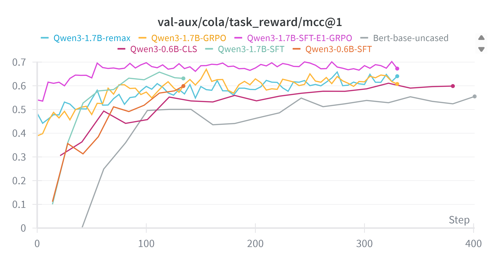

# README

**CoLA Task RL Training Codebase**

[English | [中文](README.md)]

## Table of Contents

- [Project Introduction](#project-introduction)
- [Changelog](#changelog)
- [Evaluation metrics](#Evaluation metrics)
- [Main Results](#main-results)
- [How to Use](#how-to-use)
- [TODO](#TODO)

## Project Introduction

This repository focuses on leveraging the `Qwen3` series models to perform sentence acceptability classification for the `CoLA` (Corpus of Linguistic Acceptability) subtask within the `GLUE` benchmark, using Reinforcement Learning (RL) methods. The codebase implements the complete pipeline of data preprocessing, model training, and evaluation, making it easy to get started and reproduce related research.

## Changelog

[25/09/08] Organize the main results and upload the wandb model training logs.

[25/07/23] Fixed data preparation errors, added `SFT` data preparation code and training scripts (based on the `LLaMA-Factory` framework), added `REMAX` and `DAPO` training scripts, added `Text Classification` code, and added `DeepSeek R1 0528` distilled `COLA` dataset.

[25/06/22] Completed the data processing pipeline, `GRPO` training script (based on the `verl` framework), and [documentation](docs).

## Evaluation metrics

- Evaluation Metric: [Matthews Correlation Coefficient (MCC)](https://en.wikipedia.org/wiki/Phi_coefficient)
- Prompt Template:

```
Decide whether the following sentence is grammatically acceptable or not. If it is grammatically correct, answer "acceptable". If not, answer "unacceptable". Only output "acceptable" or "unacceptable", and do not output any other information.

Sentence: {sentence}

Your answer:
```


## Main Results



|         Model          | Fine-tuning method |  验证集   | 测试集（kaggle） |
| :--------------------: | :----------------: | :-------: | :--------------: |
|       Qwen3-0.6B       |         -          |   0.223   |       TBA        |
|    DeepSeek V3 0324    |         -          | **0.726** |       TBA        |
|    DeepSeek R1 0120    |         -          |   0.636   |       TBA        |
|    DeepSeek R1 0528    |         -          |   0.658   |       TBA        |
|    Qwen3-1.7B-Remax    |     Remax (RL)     |   0.658   |       TBA        |
|    Qwen3-1.7B-GRPO     |     GRPO (RL)      |   0.669   |       TBA        |
| Qwen3-1.7B-SFT-E1-GRPO |  SFT + GRPO (RL)   | **0.702** |       TBA        |
|       Bert-base        |        CLS         |   0.548   |       TBA        |
|     Qwen3-0.6B-CLS     |        CLS         |   0.610   |       TBA        |
|     Qwen3-1.7B-SFT     |        SFT         |   0.657   |       TBA        |
|     Qwen3-0.6B-SFT     |        SFT         |   0.598   |       TBA        |

> [!Note]
>
> The suffix `SFT-E1-GRPO` indicates that the model first undergoes 1 `Epoch` of `SFT` followed by `GRPO`.
>
> The `CLS` suffix indicates that the model's output head is changed to a classification head.

## How to Use

### Environment Setup

> [!TIP]
> See the [documentation](docs/verl框架训练与Debug.md) for details.

### Model Download

- Download `Qwen3` series models from [ModelScope](https://modelscope.cn/home) or [HuggingFace](https://huggingface.co/models) and place them under the `model` directory.

### GRPO Training

- Edit the script `run_grpo_qwen3_0.6b.sh` to set up your `wandb API key`, working directory, and training GPU ID.
- Start training:

```shell
bash run_grpo_qwen3_0.6b.sh
```

## TODO

- Compare the effect of different RL algorithms on CoLA classification.
- Compare the effect of models with different parameter sizes on CoLA classification.
- Upload `wandb` reports.

## Acknowledgments

- [CoLA Dataset](https://nyu-mll.github.io/CoLA/)
- [Verl Framework](https://github.com/volcengine/verl)