# verl框架RL训练与Debug

## 前言

- 最近在做有关于`Qwen3-0.6B`RL对文本分类效果的实验，采用的框架是`verl`，这篇博客用于记录完整的实验过程，`github`开源代码[CoLA-RL](https://github.com/ytzfhqs/CoLA-RL)。
- 作者刚接触`RL`一段时间，若文中有表述不正确的地方或实验不合理的地方，也欢迎大家指出~。

## 实验配置

- 训练目标：对`Qwen3-0.6B`进行`GRPO`微调，完成`GLUE`榜单的子任务`CoLA`数据的分类。

- GPU：RTX 3090 24G × 2
- 基础模型：[Qwen3-0.6B](https://huggingface.co/Qwen/Qwen3-0.6B)
- 训练框架：[verl v0.4.0](https://github.com/volcengine/verl)
- IDE：`VS Code`
- 系统：Linux

## 数据信息

- `CoLA`[官方网站](https://nyu-mll.github.io/CoLA/)，基础信息：

| CoLA                          | 分类数 | 数据量 |
| ----------------------------- | ------ | ------ |
| 训练集（in_domain_train.tsv） | 2      | 8551   |
| 验证集（in_domain_dev.tsv）   | 2      | 527    |

- `CoLA`数据集的对比指标为[Matthews相关系数](https://en.wikipedia.org/wiki/Phi_coefficient)：

$$
MCC = \frac{TP \times TN - FP \times FN}{\sqrt{(TP + FP)(TP+FN)(TN+FP)(TN+FN)}}
$$

- 为防止测试集泄露，`CoLA`的[测试集](https://www.kaggle.com/c/cola-in-domain-open-evaluation)在`kaggle`上，我们在训练集上训练模型，验证上选取表现最好的模型，然后再测试集上测试模型精度。

## 环境搭建

### 官方推荐方式

- 首先把`verl`的代码库`clone`下来：

```shell
git clone https://github.com/volcengine/verl
```

- `verl`的[官方文档](https://verl.readthedocs.io/en/latest/start/install.html)中有比较详细的环境搭建教程，比较推荐的是使用`docker`，这里以`conda`的方式进行安装。
- 注意！`python`版本必须是3.10，否则后面安装`FlashAttention`和`FlashInfer`会失败。
- 运行官方的脚本：

```shell
USE_MEGATRON=0 bash scripts/install_vllm_sglang_mcore.sh
```

### 其他方式

- 因为上面的方式可能需要~~魔法~~，所以作者在尝试的时候，上面的方法没有成功。拆解一下官方的脚本。先安装`vllm`和`torch`相关的库。

```shel
pip install --no-cache-dir "vllm==0.8.5.post1" "torch==2.6.0" "torchvision==0.21.0" "torchaudio==2.6.0" "tensordict==0.6.2" torchdata -i https://pypi.mirrors.ustc.edu.cn/simple/
```

- 下载`FlashAttention`和`FlashInfer`离线包。可以使用[Github下载加速](https://ghproxy.link/) 。

```python
# FlashAttention下载链接
https://github.com/Dao-AILab/flash-attention/releases/download/v2.7.4.post1/flash_attn-2.7.4.post1+cu12torch2.6cxx11abiFALSE-cp310-cp310-linux_x86_64.whl

# FlashInfer下载链接
https://github.com/flashinfer-ai/flashinfer/releases/download/v0.2.2.post1/flashinfer_python-0.2.2.post1+cu124torch2.6-cp38-abi3-linux_x86_64.whl

```

- 将下载的文件放在`verl`文件夹中，`cd`到`verl`文件夹中，使用`pip`安装。

```shell
cd verl
pip install --no-cache-dir flash_attn-2.7.4.post1+cu12torch2.6cxx11abiFALSE-cp310-cp310-linux_x86_64.whl
pip install --no-cache-dir flashinfer_python-0.2.2.post1+cu124torch2.6-cp38-abi3-linux_x86_64.whl
```

- 安装剩余依赖项

```shell
pip install -e . -i https://pypi.tuna.tsinghua.edu.cn/simple
```

### 获取wandb api key

- 该步骤需要~~魔法~~，若不具备条件，可以使用`wandb`离线模式！

- `wandb`是一个面向**机器学习和深度学习实验管理**的可视化平台。它会在模型训练期间实时记录模型的指标，我们去官网注册一个账号，并拿到`key`。

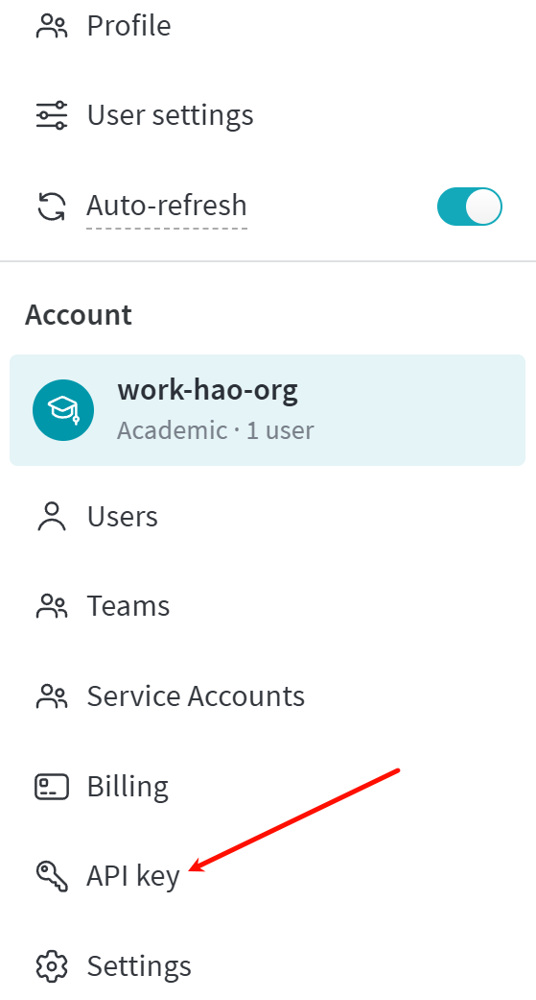

## 数据与脚本准备

- 到这里，环境搭建的工作就全部完成了。接下来我们要准备训练和验证的数据了。
- 我们先新建一个项目文件夹（不要和前面的`verl`文件夹混用，需要一个新的空文件夹）。这里我把项目文件夹命名为`cola_rl`，文件夹树状结构：

```
cola/
```

- 将从官方网站下载的`cola`数据集放在项目文件夹中，文件夹树状结构：

```
cola/
└── cola_data/
    ├── in_domain_dev.tsv
    ├── in_domain_train.tsv
    └── out_of_domain_dev.tsv
```

- 下载模型到项目文件夹的子文件夹`model`中，模型可以在`Huggingface`上下载（~~需要魔法~~），或者魔搭社区，这里以魔搭社区为例，使用`git lfs`命令（确保`lfs`被正确安装，`git lfs install`）：

```shell
git clone https://www.modelscope.cn/Qwen/Qwen3-0.6B.git
```

- 文件夹树状结构：

```
cola/
├── cola_data/
│   ├── in_domain_dev.tsv
│   ├── in_domain_train.tsv
│   └── out_of_domain_dev.tsv
└── model/
    └── Qwen3-0.6B/
        ├── model.safetensors
        └── ...
```

- 我新建了一个`jupyter notebook`用来处理数据（`prepare_data.ipynb`），文件夹树状结构：

```
cola/
├── cola_data/
│   ├── in_domain_dev.tsv
│   ├── in_domain_train.tsv
│   └── out_of_domain_dev.tsv
├── model/
│   └── Qwen3-0.6B/
│       ├── model.safetensors
│       └── ...
└── prepare_data.ipynb
```

### 数据准备

- 数据准备的`jupyter notebook`我会开源，这里主要讲一下关键点。
- 因为`CoLA`数据集是对英文句子的语法可接受性进行评价的，所以我们写一个提示词，让模型认为输入句子的语法可接受时返回`acceptable`，不可接受时返回`unacceptable`，且不要返回其他无关信息。提示词：

```python
prompt = """
Decide whether the following sentence is grammatically acceptable or not. If it is grammatically correct, answer "acceptable". If not, answer "unacceptable". Only output "acceptable" or "unacceptable", and do not output any other information.

Sentence: {sentence}

Your answer:
"""
```

- 示例：

```
Decide whether the following sentence is grammatically acceptable or not. If it is grammatically correct, answer "acceptable". If not, answer "unacceptable". Only output "acceptable" or "unacceptable", and do not output any other information.

Sentence: Our friends won't buy this analysis, let alone the next one we propose.

Your answer:
```

- 单个样本最终被组成一个`Dict[str, str]`的形式，层级关系是：

```python
{
    "data_source":,
    "prompt":[
        {
            "content":,
            "role":"user"
        }
    ],
    "reward_model":{
        "ground_truth":
    }
}
```

- `data_source`是数据标识符，这个字段和奖励函数的调用挂钩，这里我将其命名为`cola`。`prompt`是对话，但是需要注意的是`content`中的内容是提示词。`reward_model`中的`ground_truth`是答案标签。

- 因为训练的是`think`模型，所以`enable_thinking`需要打开。单个样本示例：

```
{'data_source': 'cola',
 'prompt': [{'content': 'Decide whether the following sentence is grammatically acceptable or not. If it is grammatically correct, answer "acceptable". If not, answer "unacceptable". Only output "acceptable" or "unacceptable", and do not output any other information.\n\nSentence: Our friends won\'t buy this analysis, let alone the next one we propose.\n\nYour answer:',
   'role': 'user'}],
 'reward_model': {'ground_truth': 'acceptable'}}
```

- 最后将训练集和测试集保存成`parquet`格式就行了。
- 因为`Qwen3`已经内置了`think`格式，如果你要训练的是一个`Instruction`模型，以`Qwen2.5-0.5B-Instruct`为例，你需要在提示词里面加入，==请将你的推理过程括在<think></think>标记中，即<think>推理过程</think>== 。

- 项目文件夹树状结构：

```
cola/
├── cola_data/
│   ├── in_domain_dev.tsv
│   ├── in_domain_train.tsv
│   └── out_of_domain_dev.tsv
├── data/
│   ├── cola/
│       ├── train.parquet
│       └── test.parquet
├── model/
│   └── Qwen3-0.6B/
│       ├── model.safetensors
│       └── ...
└── prepare_data.ipynb
```

## 奖励函数设计

- 将`verl`项目文件夹中的`verl`和`recipe`文件夹复制到我们的项目文件夹下。`verl`包含RL的主要训练代码，`recipe`中有一些新的算法，比如`DAPO`，项目文件夹树状结构：

```
cola/
├── cola_data/
│   ├── in_domain_dev.tsv
│   ├── in_domain_train.tsv
│   └── out_of_domain_dev.tsv
├── data/
│   ├── cola/
│       ├── train.parquet
│       └── test.parquet
├── model/
│   └── Qwen3-0.6B/
│       ├── model.safetensors
│       └── ...
├── recipe/
│   ├── char_count
│   ├── dapo
│   └── ...
├── verl/
│   ├── models
│   ├── single_controller
│   └── ...
└── prepare_data.ipynb
```

- 奖励函数在`cola/verl/utils/reward_score`文件夹下，新建一个`.py`文件，用来写`cola`数据的奖励函数，这里我就把新文件直接命名为`cola.py`。
- 因为我们已经在`prompt`中明确说明了输出只能为`unacceptable`或`acceptable`，所以我们的奖励函数也很简单，直接使用`==`运算符来匹配答案，若答案正确则得1分，若答案错误（解析错误）则得-1分。需要注意的地方是，因为我们训练的是`think`模型，思维链被包裹在`<think></think>`中，如`<think>\n这是思维链</think>\n\n答案`，所以我们要把思维链和答案分开。

```python
def extract_solution(solution_str: str) -> Tuple[Optional[str], Optional[str]]:
    content = None
    reasoning_content = None
    if m := re.match(r"<think>\n(.+)</think>\n\n", solution_str, flags=re.DOTALL):
        content = solution_str[len(m.group(0)):].strip()
        if thinking_content := m.group(1).strip():
            reasoning_content = thinking_content
    if (content is None) or (reasoning_content is None):
        print("[Error] 思维链与答案解析出错")
    return content, reasoning_content
```

- 因为`Qwen3`本身就是一个已经训练好的`Think`模型，所以我们直接进行解析，解析正确则说明格式没问题。如果是使用的`Qwen2.5`，那可能还需要多一步检查`<think>`标识符是否生成。这里放一段格式检查的代码：

```python
def validate_response_structure(processed_str: str) -> bool:
    print("\n[Structure Validation]")
    validation_passed = True

    # Check required tags
    tags = {
        'think_start': ('<think>', 1),
        'think_end': ('</think>', 1),
        'answer_start': ('<answer>', 1),
        'answer_end': ('</answer>', 1)
    }

    positions = {}
    for tag_name, (tag_str, expected_count) in tags.items():
        count = processed_str.count(tag_str)
        positions[tag_name] = pos = processed_str.find(tag_str)
        
        print(f"  {tag_str}: count={count}, position={pos}")
        
        if count != expected_count:
            print(f"  [Error] {tag_str} appears {count} times (expected {expected_count})")
            validation_passed = False

    # Verify tag order
    if (positions['think_start'] > positions['think_end'] or
        positions['think_end'] > positions['answer_start'] or
        positions['answer_start'] > positions['answer_end']):
        print("  [Error] Incorrect tag order: Expected <think>...</think><answer>...</answer>")
        validation_passed = False
    else:
        print("  Tag sequence validation passed")

    return validation_passed
```

- `extract_solution`是一个辅助函数，最关键的是`compute_score`函数，`solution_str`是模型的输出，`ground_truth`是真实标签。因为我后面还准备测试`DAPO`算法，所以多了一个参数`algorithm`，`DAPO`除了输出有一点变化，其他区别不大，我们先不管。

```python
def compute_score(solution_str: str, ground_truth: str, algorithm: str = 'grpo'):
    """计算总得分"""
    print("\n" + "="*80)
    print(" 开始新的采样 ".center(80, '='))
    # 从模型输出中分离答案和思考过程
    answer_text, processed_str = extract_solution(solution_str)
    # 成功解析
    if answer_text and processed_str:
        print("\n[正确性验证]")
        print(f"  真实标签: {ground_truth}")
        print(f"  预测标签: {answer_text}")
        print(f"\n[模型思考过程为]\n{processed_str}")
        # 检验答案是否正确
        if answer_text == ground_truth:
            total_score = 1
        else:
            total_score = -1
    else:
        total_score = -1
    print(f" 最终得分{total_score} ".center(80, '-'))

    if algorithm == 'dapo':
        acc = 1 if total_score > 0 else 0
        return {
            "score": total_score,
            "acc": acc,
            "pred": answer_text,
        }
    else:
        return total_score
```

- 可以看到逻辑非常简单，先调用`extract_solution`函数分离思维链和答案，然后对比模型答案和真实答案是否完全相等，若相等得1分，若不相等或思维链、答案解析失败得-1分。
- 完成奖励函数以后，我们还要修改`cola/verl/utils/reward_score`文件夹下的`__init__.py`文件，在`defaule_compute_score`函数的`if...else`结构中添加`cola`数据的奖励计算逻辑：

```python
def default_compute_score(data_source, solution_str, ground_truth, extra_info=None, sandbox_fusion_url=None, concurrent_semaphore=None):
    if data_source == "openai/gsm8k":
        from . import gsm8k

        res = gsm8k.compute_score(solution_str, ground_truth)
    elif data_source in ["lighteval/MATH", "DigitalLearningGmbH/MATH-lighteval"]:
        from . import math

        res = math.compute_score(solution_str, ground_truth)
        ...
    elif data_source in ["searchR1_nq", "searchR1_triviaqa", "searchR1_popqa", "searchR1_hotpotqa", "searchR1_2wikimultihopqa", "searchR1_musique", "searchR1_bamboogle"]:
        from . import search_r1_like_qa_em

        res = search_r1_like_qa_em.compute_score(solution_str, ground_truth)
    # 添加cola的奖励计算
    elif data_source in ["cola"]:
        from . import cola

        res = cola.compute_score(solution_str, ground_truth)
    ...
    else:
    	raise NotImplementedError(f"Reward function is not implemented for {data_source=}")
    if isinstance(res, dict):
        return res
    elif isinstance(res, (int, float, bool)):
        return float(res)
    else:
        return float(res[0])
```

## 训练脚本

- 完成奖励函数的设计，接下来就要开始编写训练脚本了，我们可以在官方的`GRPO`算法脚本基础上进行修改（`verl/examples/grpo_trainer/run_qwen3-8b.sh`），参数的含义可以参考[官方文档](https://verl.readthedocs.io/en/latest/examples/config.html)。在项目文件夹下新建一个`sh`脚本文件`run_grpo_qwen3_0.6b.sh`。将官方脚本复制粘贴到新建的脚本文件下，并进行一些修改，修改项包括：
  - `train_files`：训练数据集路径，设为`data/cola/train.parquet`。
  - `val_files`：验证数据集路径，设为`data/cola/train.parquet`。
  - `train_batch_size`：训练`batch_size`，缩小一点，我取的是256（示情况而定）。
  - `max_prompt_length`：最大提示词长度，因为`cola`的句子普遍较短，设为256。
  - `max_response_length`：最大模型回复长度，为了让模型充分思考，设为2048（其实1024也够用，这里我只是不希望模型还没输出答案就被截断）。
  - `actor_rollout_ref.model.path`：训练模型路径。
  - `actor_rollout_ref.actor.ppo_mini_batch_size`：`ppo`算法的`mini_batch_size`，也适当缩小一点，取32。
  - `actor_rollout_ref.rollout.tensor_model_parallel_size`：`vllm`引擎模型`rollout`张量并行数，该参数在单块`GPU`无法完全加载全部模型权重情况下使用，若设为2，则代表把1个模型的权重分片装载在2块`GPU`上（会增加通讯时间，所以尽可能的设小）。因为单块3090 24G可以完全加载`Qwen3-0.6B`的模型权重，所以设为1即可。
  - `actor_rollout_ref.rollout.gpu_memory_utilization`：`vllm`引擎模型`rollout`时的显存占用比例，可以稍微调大一点点，取0.65。
  - `actor_rollout_ref.rollout.n`：模型`rollout`结果的次数，稍微调大一点是对结果有轻微正向效果的，取16。
  - `trainer.logger`：日志记录方式，选择`wandb`。
  - `trainer.project_name`：`wandb`的项目名称，设为：`GRPO-CoLA`。
  - `trainer.experiment_name`：`wandb`项目的实验名称，设为`Qwen3-0.6B`。
  - `trainer.n_gpus_per_node`：`GPU`数量，我用了2块`GPU`，设为2。
  - `trainer.save_freq`：模型`checkpoint`保存频率（以`step`为单位），假如`epoch`为10，我想保存10个`checkpoint`，`train_batch_size`为256，训练集样本数为8551，则:

&emsp; &emsp; $$save\_freq = \lfloor n \div batch\_size \times epoch \div checkpoint\_nums\rfloor = \lfloor8551 \div 256 \times 10 \div 10 \rfloor= 33$$

- `trainer.test_freq`：模型测试频率（以`step`为单位），参考`save_freq`，我想每保存1次模型权重，中间测试三次模型效果，则$\lfloor33 \div 3\rfloor \approx 10$。

- `trainer.total_epochs`：模型`epoch`数，稍微取小一点，设为10。

- 完成上诉的基础修改，我们还需要参照官方文档的[性能调优指南](https://verl.readthedocs.io/en/latest/perf/perf_tuning.html)，再细致化的调整一些参数。
  - 去掉所有固定`micro_batch_size`（如`actor_rollout_ref.actor.ppo_micro_batch_size_per_gpu`、`actor_rollout_ref.rollout.log_prob_micro_batch_size_per_gpu`、`actor_rollout_ref.ref.log_prob_micro_batch_size_per_gpu`），使用动态`batch size`：

  - ```shell
    actor_ppo_max_token_len=$((1024 * 6))
    infer_ppo_max_token_len=$((1024 * 6))
    
    actor_rollout_ref.actor.use_dynamic_bsz=${use_dynamic_bsz} \
    actor_rollout_ref.actor.ppo_max_token_len_per_gpu=${actor_ppo_max_token_len} \
    
    actor_rollout_ref.ref.log_prob_use_dynamic_bsz=${use_dynamic_bsz} \
    actor_rollout_ref.ref.log_prob_max_token_len_per_gpu=${infer_ppo_max_token_len} \
    
    actor_rollout_ref.rollout.log_prob_use_dynamic_bsz=${use_dynamic_bsz} \
    actor_rollout_ref.rollout.log_prob_max_token_len_per_gpu=${infer_ppo_max_token_len} \
    
    - 使用`Ulysses Sequence Parallel`进行长上下文训练，我有2块GPU，所以
    
    - ```shell
      sp_size=2
      gpu_nums=2
      
      actor_rollout_ref.actor.ulysses_sequence_parallel_size=${sp_size} \
      actor_rollout_ref.ref.ulysses_sequence_parallel_size=${sp_size} \
    ```

  - `actor_ppo_max_token_len`和`infer_ppo_max_token_len`的数值是我测试出来的，在0.6B参数量下能吃到24G显存的90%以上，大家可以根据模型的参数量变化和显存大小自行调节。
  
- 根据[verl v0.4.0 release](https://github.com/volcengine/verl/releases/tag/v0.4.0)，设置`FSDP2`会获得更好的`GPU`吞吐量和内存使用率，所以

```shell
actor_rollout_ref.ref.strategy=fsdp2
actor_rollout_ref.actor.strategy=fsdp2
critic.strategy=fsdp2 
reward_model.strategy=fsdp2 
```

- 整合上述的所有改动和一些必要的环境变量设置（`WANDB_API_KEY`、`CUDA_VISIBLE_DEVICES`等），得到以下完整的训练脚本：

```shell
set -x

# wandb api key配置
export WANDB_API_KEY=...
# 工作目录
export PYTHONPATH=...
# 训练GPU编号
export CUDA_VISIBLE_DEVICES=0,3

use_dynamic_bsz=True
actor_ppo_max_token_len=$((1024 * 6))
infer_ppo_max_token_len=$((1024 * 6))

sp_size=2
gpu_nums=2

CHECKPOINT_PATH=model/Qwen3-0.6B
project_name='GRPO-CoLA'
experiment_name='Qwen3-0.6B'

python3 -m verl.trainer.main_ppo \
    algorithm.adv_estimator=grpo \
    data.train_files=data/cola/train.parquet \
    data.val_files=data/cola/test.parquet \
    data.train_batch_size=256 \
    data.max_prompt_length=256 \
    data.max_response_length=2048 \
    critic.strategy=fsdp2 \
    reward_model.strategy=fsdp2  \
    actor_rollout_ref.model.path="${CHECKPOINT_PATH}" \
    actor_rollout_ref.model.use_remove_padding=True \
    actor_rollout_ref.model.enable_gradient_checkpointing=True \
    actor_rollout_ref.actor.optim.lr=1e-6 \
    actor_rollout_ref.actor.strategy=fsdp2 \
    actor_rollout_ref.actor.use_kl_loss=True \
    actor_rollout_ref.actor.kl_loss_coef=0.001 \
    actor_rollout_ref.actor.ppo_mini_batch_size=32 \
    actor_rollout_ref.actor.kl_loss_type=low_var_kl \
    actor_rollout_ref.actor.fsdp_config.fsdp_size=-1 \
    actor_rollout_ref.actor.fsdp_config.param_offload=False \
    actor_rollout_ref.actor.use_dynamic_bsz=${use_dynamic_bsz} \
    actor_rollout_ref.actor.fsdp_config.optimizer_offload=False \
    actor_rollout_ref.actor.ulysses_sequence_parallel_size=${sp_size} \
    actor_rollout_ref.actor.ppo_max_token_len_per_gpu=${actor_ppo_max_token_len} \
    actor_rollout_ref.ref.strategy=fsdp2 \
    actor_rollout_ref.ref.fsdp_config.param_offload=True \
    actor_rollout_ref.ref.log_prob_use_dynamic_bsz=${use_dynamic_bsz} \
    actor_rollout_ref.ref.ulysses_sequence_parallel_size=${sp_size} \
    actor_rollout_ref.ref.log_prob_max_token_len_per_gpu=${infer_ppo_max_token_len} \
    actor_rollout_ref.rollout.log_prob_use_dynamic_bsz=${use_dynamic_bsz} \
    actor_rollout_ref.rollout.log_prob_max_token_len_per_gpu=${infer_ppo_max_token_len} \
    actor_rollout_ref.rollout.tensor_model_parallel_size=1 \
    actor_rollout_ref.rollout.name=vllm \
    actor_rollout_ref.rollout.gpu_memory_utilization=0.65 \
    actor_rollout_ref.rollout.n=16 \
    actor_rollout_ref.rollout.temperature=1.0 \
    actor_rollout_ref.rollout.top_p=1.0 \
    actor_rollout_ref.rollout.val_kwargs.temperature=0.6 \
    actor_rollout_ref.rollout.val_kwargs.top_p=0.95 \
    actor_rollout_ref.rollout.val_kwargs.do_sample=True \
    actor_rollout_ref.rollout.val_kwargs.n=1 \
    actor_rollout_ref.rollout.enforce_eager=True \
    algorithm.use_kl_in_reward=False \
    algorithm.kl_ctrl.kl_coef=0.001 \
    trainer.critic_warmup=0 \
    trainer.logger=['wandb'] \
    trainer.project_name=${project_name} \
    trainer.experiment_name=${experiment_name} \
    trainer.n_gpus_per_node=${gpu_nums} \
    trainer.nnodes=1 \
    trainer.save_freq=33 \
    trainer.resume_mode=auto \
    trainer.test_freq=10 \
    trainer.total_epochs=10 $@ 2>&1 | tee phase1.log
```

- 完成训练脚本的编写以后，就可以使用在终端输入`bash run_grpo_qwen3_0.6b.sh`启动训练。
- 项目文件夹树状结构：

```
cola/
├── cola_data/
│   ├── in_domain_dev.tsv
│   ├── in_domain_train.tsv
│   └── out_of_domain_dev.tsv
├── data/
│   ├── cola/
│       ├── train.parquet
│       └── test.parquet
├── model/
│   └── Qwen3-0.6B/
│       ├── model.safetensors
│       └── ...
├── recipe/
│   ├── char_count
│   ├── dapo
│   └── ...
├── verl/
│   ├── models
│   ├── single_controller
│   └── ...
├── prepare_data.ipynb
└── run_grpo_qwen3_0.6b.sh
```


## Debug过程

### 普通脚本

- 先回顾一下`VSCode`如何对普通的`sh`脚本进行`debug`。先安装`debugpy`库`pip install debugpy`。新建`lauch.json`文件进行调试。

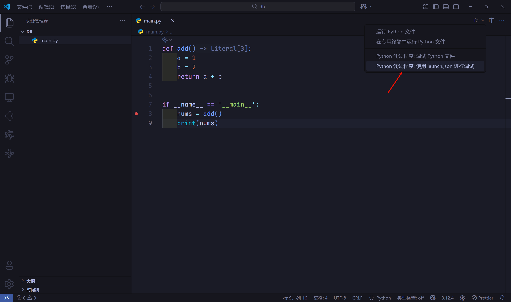

- 修改`lauch.json`文件。

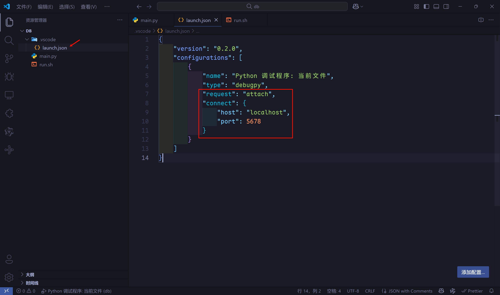

- 修改`sh`脚本，由`python main.py`，变为`python -m debugpy --listen localhost:5678 --wait-for-client main.py`，注意`listen`参数的端口必须和`lauch.json`文件中`connect`一致。
- 先在终端中输入`bash run.sh`，然后等待一小会，点击`VSCode DeBug`界面的运行（太快可能会触发`connect ECONNREFUSED`错误），就可以开始DeBug了。

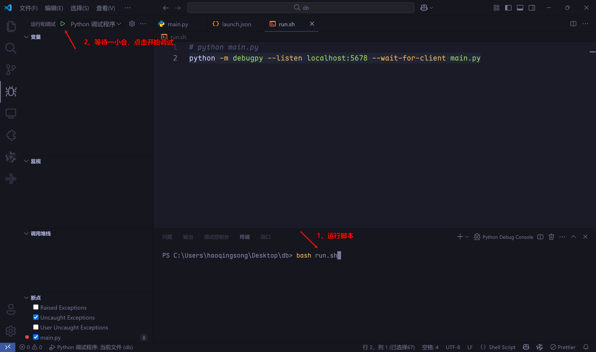

### Ray框架

- 上述方法不适用于使用`Ray`框架的`verl`，所以要使用另外一种方式，参考[官方文档](https://verl.readthedocs.io/en/latest/start/ray_debug_tutorial.html)。安装`debugpy`库`pip install debugpy`，安装VSCode扩展[Ray Distributed Debugger](https://docs.ray.io/en/latest/ray-observability/ray-distributed-debugger.html)。

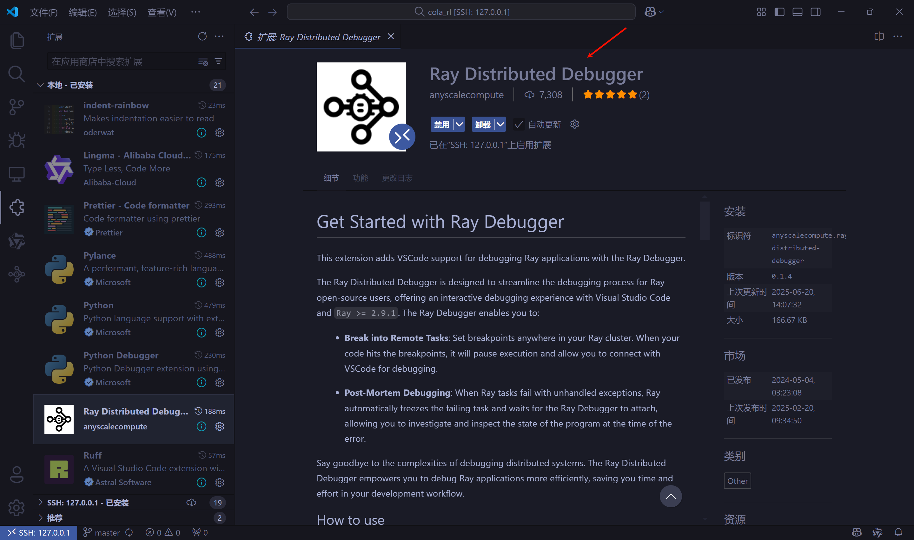

- 不要对`run_grpo_qwen3_0.6B.sh`脚本进行任何修改，也不要使用`lauch.json`文件。直接找到想要打断点的代码，比如我想要看一下在模型训练过程中，测试阶段是怎么做的，打开项目文件夹下的`verl/trainer/ppo/ray_trainer.py`文件，在模型测试阶段的前面添加一行代码`breakpoint()`。

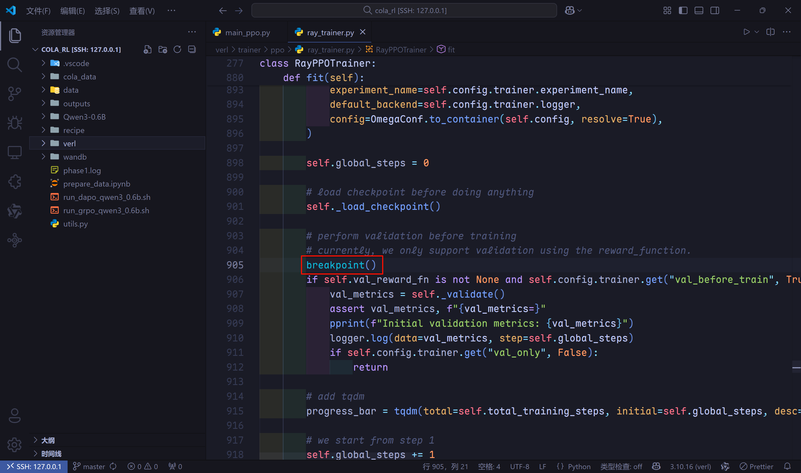

- 我们再打一个断点，用来检查各类指标的计算，在项目文件夹`verl/trainer/ppo/metric_utils.py`文件中。

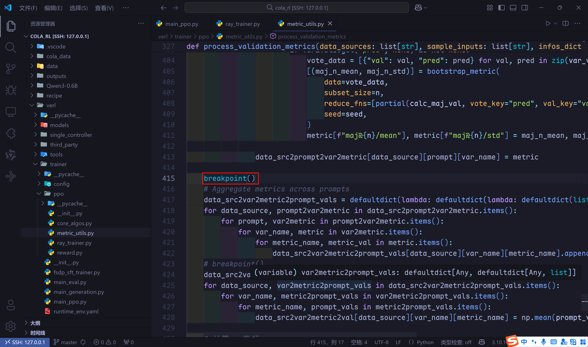

- 打完断点后，在终端中运行`run_grpo_qwen3_0.6B.sh`脚本，当终端中显示`Ray debugger is ...`信息时，进入`Ray Distributed Debugger`扩展，发现一个`TaskRunner.run`，鼠标移动到选项末尾，出现`debug`按钮，点击`debug`按钮。

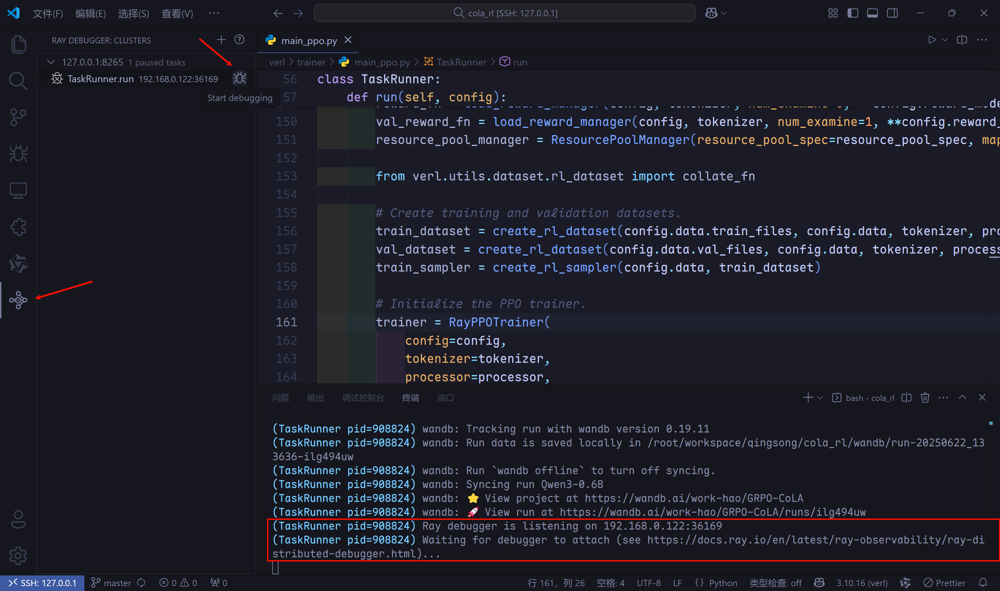

- 代码跳转到我们打的第一个断点，变量和debug面板也都出现了，调试控制台也可以键入表达式，后面正常使用单步调试或逐过程即可。

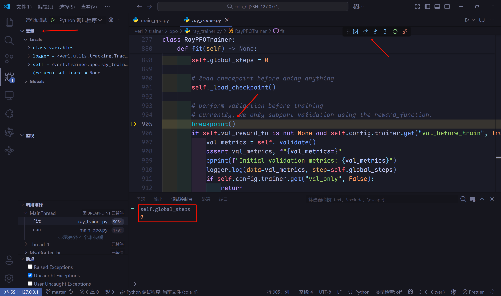

- 若想要跳转到第2个断点，先点击debug面板中的继续，直到其变成暂停按钮，（等几秒）然后点击断开连接（点击多次，直到debug面板消失）。若`debug`面板没有消失，`Ray Distributed Debugger`扩展的`debug`按钮是无法点击的。

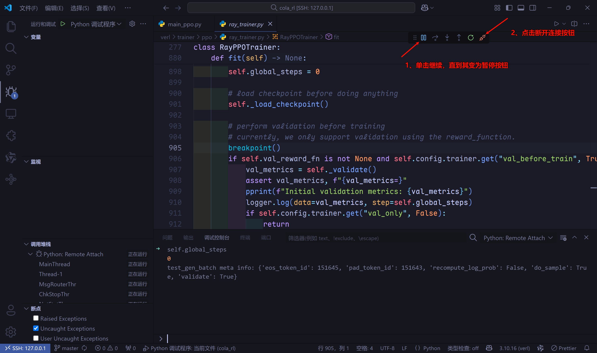

- 等待一会，`Ray Distributed Debugger`扩展会出现一个新的检查点，这就是我们第2个断点。和前面一样，点击检查点末尾的debug按钮。

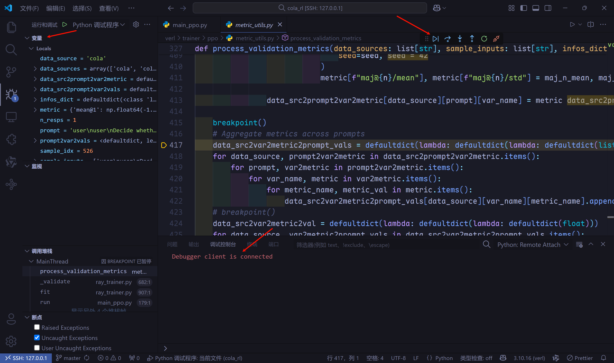

- 若调试完，进行正式的训练过程，请删除代码中的`breakpoint()`或注释掉，否则会阻塞训练进程。

## 添加监控指标

- 因为`CoLA`数据集的评估指标是`MCC`，所以想模型测试阶段除了计算奖励，也计算一下`MCC`。
- 思路：拿到每个样本的真实标签和模型预测标签的奖励，若奖励为1，则预测标签与真实标签一致，若奖励为-1，则预测标签与真实标签相反，最后使用`sklearn`提供的`matthews_corrcoef`函数计算`MCC`指标。
- 至于如何添加，在哪里添加，就需要使用上节的`debug`步骤来找到测试模块的代码了。这里我不过多赘述，直接说明代码修改点。
- 项目文件夹`verl/trainer/ppo/ray_trainer.py`文件`RayPPOTrainer`类`_validate`方法，添加了一行代码`reward_extra_infos_dict['label'].extend([x['ground_truth'] for x in test_data['reward_model']])`。

```python
def _validate(self):
    data_source_lst = []
    reward_extra_infos_dict: dict[str, list] = defaultdict(list)
    ...

        # evaluate using reward_function
        result = self.val_reward_fn(test_batch, return_dict=True)
        reward_tensor = result["reward_tensor"]
        scores = reward_tensor.sum(-1).cpu().tolist()
        sample_scores.extend(scores)

        reward_extra_infos_dict["reward"].extend(scores)

        # 添加真实标签
        reward_extra_infos_dict['label'].extend([x['ground_truth'] for x in test_data['reward_model']])
        if "reward_extra_info" in result:
            for key, lst in result["reward_extra_info"].items():
                reward_extra_infos_dict[key].extend(lst)
        ...
```

- 项目文件夹`verl/trainer/ppo/metric_utils.py`文件`process_validation_metrics`函数，添加代码块**计算mcc指标**。

```python
def process_validation_metrics(data_sources: list[str], sample_inputs: list[str], infos_dict: dict[str, list[Any]], seed: int = 42) -> dict[str, dict[str, dict[str, float]]]:
    ...
    # breakpoint()
    data_src2var2metric2val = defaultdict(lambda: defaultdict(lambda: defaultdict(float)))
    for data_source, var2metric2prompt_vals in data_src2var2metric2prompt_vals.items():
        for var_name, metric2prompt_vals in var2metric2prompt_vals.items():
            for metric_name, prompt_vals in metric2prompt_vals.items():
                data_src2var2metric2val[data_source][var_name][metric_name] = np.mean(prompt_vals)

    # 计算MCC指标
    if "cola" in data_source and 'label' in infos_dict:
        labels = [1 if x=='acceptable' else 0 for x in infos_dict["label"]]
        preds = []
        for r, lb in zip(infos_dict["reward"], labels):
            if r > 0:
                preds.append(lb)
            else:
                if lb == 1:
                    preds.append(0)
                else:
                    preds.append(1)
        data_src2var2metric2val[data_source]['task_reward']['mcc@1'] = np.float64(matthews_corrcoef(labels, preds))

    return data_src2var2metric2val
```

- 只需要修改上诉的2处代码即可监控模型在验证集上的`MCC`指标。
